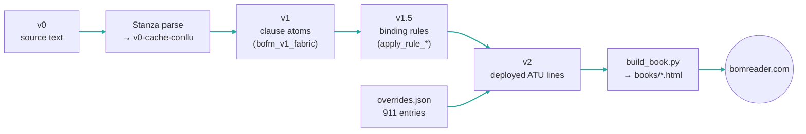
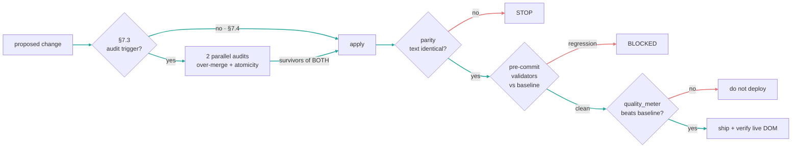
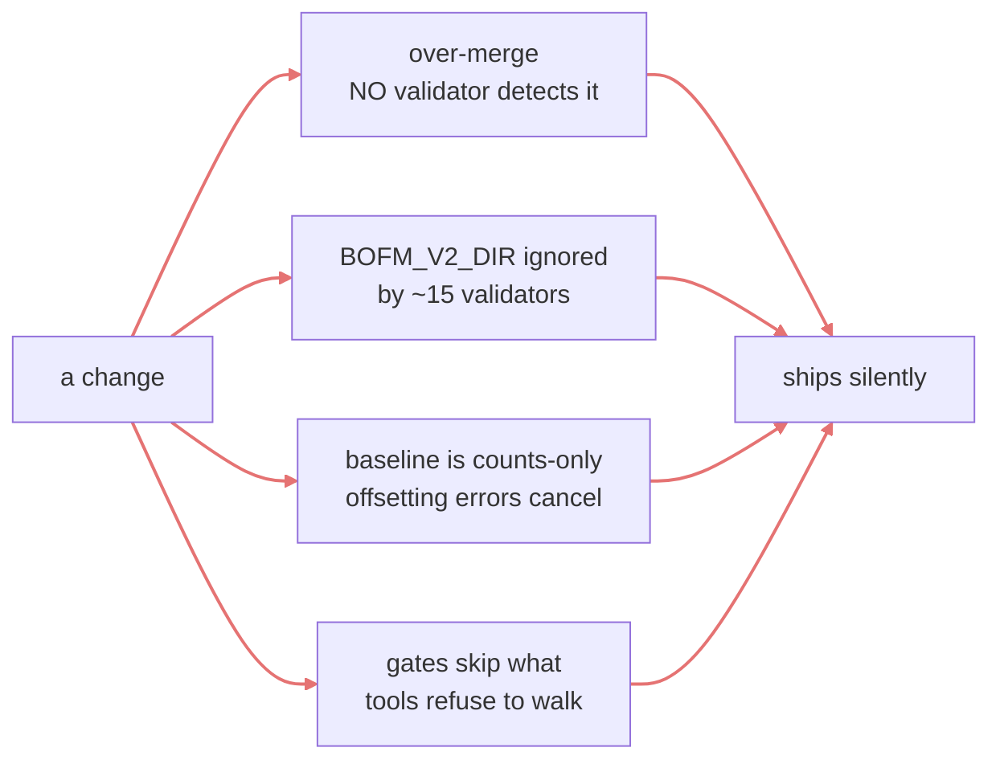

# Pipeline and Gates — what runs, what blocks, and what nothing catches

**Purpose**: one place to see how a segmentation change travels from idea to bomreader.com, which gate stands at each seam, and — most important — **which failure classes have no gate at all**. Written 2026-08-06 after a cross-repo edit introduced 103 dangling canon citations that this repo's pre-commit gate caught and the originating repo's checker did not.

**The one-line lesson from that incident**: *a gate only sees what it is pointed at.* The repointing tool skipped `private/`, and the integrity checker in the other repo could not see what the repointer refused to walk. Two tools shared a blind spot and both reported clean.

---

## The corpus pipeline



```
 v0 ──parse──▶ v0-cache-conllu ──▶ v1 clause atoms ──▶ v1.5 binding rules ──▶ v2
                                                    overrides.json ──────────▶ v2
 v2 ──build_book.py──▶ books/*.html ──▶ bomreader.com   (+ bump sw.js cache)
```

Three levers change what v2 says, in ascending order of preference:

1. **Binding rules** in `bofm_v1_fabric.py` / `apply_rule_*` — permanent, corpus-wide, cheapest to maintain. Try first.
2. **UD corrections** to `v0-cache-conllu` — fixes the substrate the rules read. 781 full-class candidates remain in `data/parses/audit/ud-correction-fullclass-candidates.json`.
3. **`data/text-files/v2-adjudicated/overrides.json`** — judgment residuals neither of the above reaches. Token-exact and parity-safe.

## Where the gates stand



```
 change ─▶ [§7.3 audit?] ─yes─▶ 2 audits ─survivors─┐
              └─no (§7.4)───────────────────────────┴─▶ apply
 apply ─▶ [parity] ─▶ [pre-commit validators vs baseline] ─▶ [quality_meter] ─▶ ship
            │ fail          │ regression                       │ not better
            STOP            BLOCKED                             do not deploy
```

| Gate | Where | Catches | Blind to |
|---|---|---|---|
| **§7.3 audit triggers** | before any canon edit | new rules, scope claims, closed-list extensions, retiring live rules | anything not recognised as a trigger |
| **2 parallel adversarial audits** | inside the spray Workflow | over-merge, over-fragmentation | classes the candidate scan never surfaced |
| **Text parity** | `apply_spray_survivors.py` | any change that alters characters rather than break positions | nothing — this one is reliable |
| **Pre-commit validators** | `.git/hooks/pre-commit` → `validators/run_all.py --baseline-check` | canon-conformance regressions per rule | **over-merge entirely**; see below |
| **quality_meter** | before deploy | net defect delta vs baseline, by genre | needs an LLM adjudication pass to produce verdicts |
| **Live-DOM verify** | after push | "commit succeeded but the page didn't change" | nothing, if actually run |

## The blind spots — read this part twice



- **No validator detects over-merge.** This is Stan's red line and the automated layer is blind to it. Only the adversarial audits and `quality_meter` see it. Never let a merge reach deploy on validator-clean alone.
- **~15 older validators ignore `BOFM_V2_DIR`** and glob the real v2 directory, so a prototype scored through the override silently measures the *old* corpus.
- **`--baseline-check` is counts-only.** A fix and a new break of equal size cancel out. Honest triage needs a per-violation set diff.
- **`--update-baseline` on a regressed run is forbidden.** It converts a regression into the new normal.
- **A gate only sees what it is pointed at** — the 2026-08-06 incident. Cross-repo tooling must walk the canon under `private/`, not just public docs.

## Current gate state (2026-08-06)

`validate_doc_pointers.py` is CLEAN. Four validators sit **above baseline and are not from this session's work** — `data/`, `books/`, `validators/` were untouched:

| Validator | Baseline | Current |
|---|---|---|
| `validate_rule_12_compound_verb.py` | 1 | 3 |
| `validate_rule_15_vocative.py` | 227 | 230 |
| `validate_rule_19_ud.py` | 960 | 970 |
| `validate_rule_29_ud.py` | 3 | 4 |

These currently **block any commit that stages canon or corpus**. Doc-only commits skip the check. Resolving them is a Stan decision: investigate, or waive with `--no-verify` and say why in the message.

## Related

- `.claude/skills/bofm-rebreak-at-scale/SKILL.md` — the same chain as an invocable procedure
- `3-project/14-operational-protocols.md` — shell and commit discipline
- `../atu-method/1-method/framework.md` §7 — the change protocol the §7.3 gate implements
- `../atu-method/4-process/improvement-loops.md` — why gates that never run are the actual failure mode
