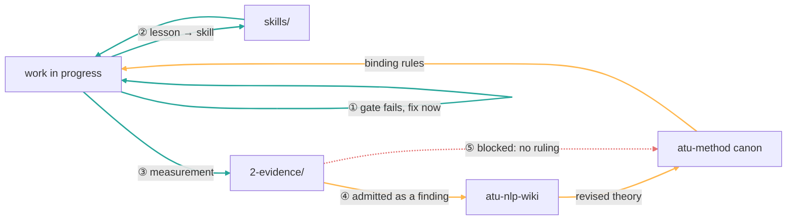

# The loops in this repo — what actually turns, and what doesn't

**Summary**: How work here is supposed to get better at itself, honestly assessed.
Sibling to [`atu-method/4-process/improvement-loops.md`](../../atu-method/4-process/improvement-loops.md),
which maps the *methodology* loops; this one maps the *corpus* loops, because
readers-bofm is the only place that can produce evidence about the deployed
edition. Written 2026-08-07 at Stan's request: *"should you have your own version
of a sketch of your understanding of your improvement loop?"*

**The honest headline**: of five loops, **two turn**, one is newly built and
unproven, one is blocked on a ruling, and one has never completed a cycle. The
one that turns best is also the shortest — and that is the finding, not an
accident.

**Last updated**: 2026-08-07

---

## The radius principle

The loops differ by *radius* — how far a lesson has to travel before it comes
back as improved behaviour. Short-radius loops are cheap, fast, and reliable.
Long-radius loops are where the valuable findings live and where they get stuck.



```
  ⓪ across sessions    read a sibling repo's JSONL transcript  TURNS  (human-carried)
  ① within a turn      run a gate, it fails, fix it            TURNS  (minutes)
  ② within the repo    a paid-for lesson becomes a skill       TURNS  (new)
  ③ into evidence      a measurement lands in 2-evidence/      BUILT  (unproven)
  ④ into theory        a finding revises the ATU thesis        BLOCKED
  ⑤ back to canon      revised theory changes binding rules    BLOCKED
```

Loop ⓪ is numbered zero because it is not a step in the chain — it is the
**sight** the other loops depend on. A session that cannot see its siblings will
happily rebuild what one of them already has, or act on a fact that another one
already disproved. It is listed first for that reason, and because it is the
cheapest of all of them.

## Loop ① — Gate → fix, within a single turn (TURNS)

The only self-correction here that is genuinely reliable, because **it does not
depend on anyone remembering anything.** A validator runs, fails, and the failure
is the instruction.

**Evidenced, 2026-08-07.** A `handoffs/` → `docs/` rename and the later
`private/01-method/` → `1-method/` move produced five defects, all caught within
minutes of being introduced:

| defect | how it was caught |
|---|---|
| atu-method's checker rewritten to skip its own `docs/` tree | its broken-path count jumped to 178 |
| two validators globbing a directory that no longer existed | **"Files scanned" fell 18 → 3** |
| retraction log entering a validator's scope for the first time | 0 → 14, investigated rather than suppressed |
| an exemption set matched on `Path.name` given a *path* | 14 false positives returned |
| **the pre-commit hook's trigger paths left pointing at moved files** | found by reading the hook — **no gate reports this one** |

**The failure branch is real and is the most important line in this document.**
The last row was not caught by any instrument. `.git/hooks/pre-commit` is not
version-controlled, is not walked by any repointer, and is not scanned by either
pointer validator — so when the canon moved, the hook silently stopped firing on
canon edits and *nothing said so*. It was found only because a human question
sent me to read the file. **A gate that guards the repo but lives outside the
repo's own checks is invisible to them.**

## Loop ② — Lesson → skill (TURNS, new)

A procedure that has cost something twice becomes a skill, so the next session
pays once instead of again.

**Evidenced same-day.** `.claude/skills/repoint-paths-safely/` was written after
the third repoint defect and immediately caught four more during the very next
move — including one it did not yet contain (a validator exemption compared
against a bare filename, where a path can never match). That last one is the
loop's *own* failure branch: **a skill is only as good as its last incident, and
the incident that would improve it always arrives after it is written.**

Cost of the loop not running: the 2026-08-06 cross-repo repoint that produced 103
dangling canon citations was the same class as all five of the above, a day
earlier, with no skill to inherit.

## Loop ③ — Measurement → `2-evidence/` (BUILT 2026-08-07, unproven)

The reader repo is the only place that can measure the deployed edition. Until
today those measurements had nowhere to live: `research/` is gitignored, and
findings landed as loose `research-*.md` at the repo root or died in chat.

`2-evidence/` now exists and holds two findings. **Zero cycles completed** — a
cycle is only complete when a finding changes something downstream.

**Rule for this loop, learned the hard way:** the *instrument* must land with the
finding. A finding that names a script living in a session scratchpad is a
phantom citation — the exact failure class `atu-method/canon-index.md` was built
to track, where two carve-outs were found "cited as existing and defined
nowhere."

## Loop ⓪ — Cross-session sight (TURNS, but human-carried)

**The channel that makes the others possible, and the one easiest to overlook
because it does not look like a loop.**

Every session runs in one repo and cannot see what a session in another repo
decided. But Claude Code writes every session to JSONL under
`~/.claude/projects/<cwd-slug>/`, and that record survives compaction. A session
here can read what `atu-method`, `meta-wiki`, or `atu-nlp-wiki` actually said.
Tool: the user-level `JSONL: <workspace>` skill; local script
`scripts/dump_session_tail.py`.

**Evidenced three times on 2026-08-07**, and the third is the clearest case for
the channel's value:

1. Reading the `meta-wiki` transcript surfaced a `findings/` layer already
   designed and queued for Stan — which this repo's `2-evidence/` is the
   producing half of. Neither side knew about the other.
2. Reading the `atu-method` transcript surfaced the analysis that the validator
   baseline stopped functioning as a control on 2026-05-29 — a fact that governs
   every commit made here and is recorded nowhere in this repo.
3. Reading `atu-method` again, to smoke-test a script, revealed that session was
   **mid-build on the very skill this session was about to ship**. A duplicate
   was avoided by looking. Without the channel, two repos would have grown two
   versions of the same tool and drifted.

**The failure branch, stated plainly: the channel is human-carried.** It fires
only when Stan says "JSONL: X". No session checks its siblings on its own, at
wake or at any other point. That makes Stan the transport layer between his own
repos — which is exactly the thing that does not scale, and the same shape as
every other blockage in this document: the mechanism exists, and a human has to
walk the message across.

*(A live instance of the drift this prevents: two user-level skills, `jsonl/` and
`read-jsonl/`, currently both claim the `JSONL: <workspace>` trigger with
different SKILL.md files and different scripts. Flagged 2026-08-07; one should
win.)*

## Loop ④ — Finding → theory (BLOCKED)

`atu-nlp-wiki` adjudicates the ATU thesis and states that its own central claim
cannot be tested from `raw/` alone: *"the primary instrument testing the
hypothesis is currently also its source."* Corpus evidence is the missing half of
its falsification program, and a `findings/` layer is queued in its
`Pending-Decisions.md` awaiting Stan.

## Loop ⑤ — Theory → canon → rules (BLOCKED, and this is the binding constraint)

Even if ③ and ④ ran, the return edge is closed by a standing rule.
`atu-method/memories/operational/feedback_external_unit_is_not_atu.md` instructs:
*"reject the granularity calibrated to their unit (Scheppers' fronting rule,
Marschall's syllable counts)."*

Every non-circular comparandum available is measured in exactly those units —
Marschall's syllable bands, Skousen's sense-lines, Parry's parallel members. So a
finding arrives at a canon with an instruction to reject it.

**The rule is correct about licensing and over-broad about noticing.** A syllable
count must never *license* a break; that is the objectivity firewall and it
should hold. But nothing about that firewall requires being unable to *see* a
121-word line. The licensor-vs-detector ruling in `Pending-Decisions.md` is the
single decision that unblocks loops ③–⑤ together.

## What no loop covers

- **No loop improves the substrate.** The Stanza-on-Early-Modern-English parse is
  the ceiling on output quality, the parser-training route is closed, and nothing
  here is trying to raise it. `atu-method`'s own loop document names this as its
  most important missing loop, and it is missing here too.
- **No gate detects over-merge** — Stan's red line, invisible to the entire
  automated layer.
- **The baseline stopped being a control on 2026-05-29.** Six corpus-changing
  ships landed after it without it moving, so it was almost certainly bypassed
  each time. A gate that is routinely overridden has stopped being a gate.
- **Nothing measures whether any of this improves the edition.** The one real
  yardstick (33 stratified verses, F1 ≈ 0.67) was measured once, on 2026-05-28,
  and never re-run.

## The pattern across all six

The loops that turn are the ones that are **mechanical and local**: a gate fails
in front of you, or a procedure is written down where the next session will read
it. The ones that are stuck all require **a decision or a hand-off across a
boundary**.

Loop ⓪ sits awkwardly across that line, and the awkwardness is informative. The
*mechanism* is mechanical and it works — the transcripts are on disk, the script
runs, and it has already prevented one duplicate build. But the *trigger* is a
human sentence. So the channel is only as reliable as Stan remembering to open
it, which makes a working tool behave like a blocked loop.

That is the cheapest thing on this page to fix, and it is not a tooling problem:
nothing tells a waking session that its siblings exist and are worth checking.
A line in `CLAUDE.md` — *before acting on a cross-repo fact, read the sibling's
transcript* — would convert loop ⓪ from human-carried to standing, at the cost of
one sentence.

The wider prediction: cheap wins are always in ⓪, ① and ②, and they compound
quietly. But the findings that would change what the edition *is* all sit in
③–⑤, behind one ruling.

## Related

- [`01-pipeline-and-gates.md`](01-pipeline-and-gates.md) — the gates themselves, and their blind spots
- [`../Pending-Decisions.md`](../Pending-Decisions.md) — the rulings loops ④/⑤ wait on
- [`../2-evidence/`](../2-evidence/) — what loop ③ has produced so far
- [`.claude/skills/repoint-paths-safely/`](.claude/skills/repoint-paths-safely/) — loop ②'s first output
